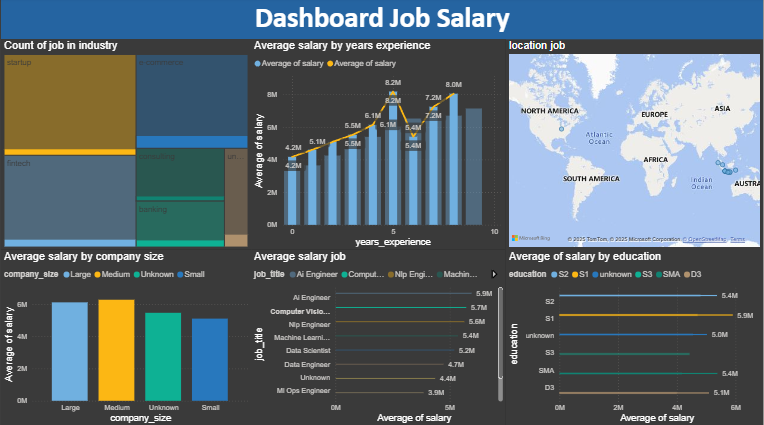

# 📊 Indonesia AI Salary Analysis 2024 (End-to-End Project)

## 📌 Deskripsi Proyek
Project ini bertujuan untuk menganalisis lanskap gaji profesional AI dan Data di Indonesia. Dataset ini bersumber dari kaggle dataset [Indonesian AI & Data Jobs Salary](https://www.kaggle.com/datasets/pu15vy/indonesian-ai-and-data-jobs-salary) berisi 500 baris data.

Analisis dilakukan secara end-to-end: pembersihan data, pemrosesan dan penyimpanan di database, serta visualisasi interaktif.

### ❓ Pertanyaan Bisnis
- Peran apa yang memberikan rata-rata kompensasi tertinggi di industri AI?
- Apakah jenjang pendidikan berbanding lurus dengan kenaikan rata-rata gaji?
- Kota mana yang menjadi hub utama dengan standar gaji paling kompetitif?

## 📊 Data Dictionary
| Kolom | Deskripsi | Tipe Data |
| :--- | :--- | :--- |
| job_title | Nama spesifik dari peran/pekerjaan di bidang Data & AI. | String |
| years_experience | Total pengalaman kerja profesional (tahun). | Float |
| location | Kota tempat perusahaan beroperasi. | String |
| education | Jenjang pendidikan terakhir (SMA, D3, S1, S2, S3). | String |
| company_size | Ukuran perusahaan berdasarkan jumlah karyawan. | String |
| industry_type | Sektor bisnis perusahaan (Fintech, Startup, Banking, dll). | String |
| salary | Gaji bulanan dalam Rupiah (IDR). | Integer |

## 🛠️ Tech Stack & Tools
- Excel (Power Query): Data cleaning & handling missing values
- MySQL: Database management & aggregasi data
- Power BI: Interactive dashboard & data storytelling

## 🔍 Data Analytics Lifecycle

### 1. Data Cleaning (Excel / Power Query)
- Mengatasi missing values pada kolom `salary`, `location`, dan `education`.
- Menghapus 16 baris yang tidak memiliki informasi gaji (target variable).
- Standardisasi penulisan nama kota dan job title menggunakan fitur Transform di Power Query.

### 2. Database & SQL Exploration (MySQL)
Data yang bersih diimpor ke MySQL untuk analisis agregasi. Contoh query:

```sql
-- Analisis Kompensasi Per Role (Aggregation)
SELECT
  job_title,
  AVG(salary) AS avg_salary,
  COUNT(*) AS total_workers
FROM ai_data_salary
GROUP BY job_title
ORDER BY avg_salary DESC;

-- Analisis Korelasi Pendidikan & Gaji
SELECT
  education,
  MIN(salary) AS min_salary,
  AVG(salary) AS avg_salary,
  MAX(salary) AS max_salary
FROM ai_data_salary
GROUP BY education
ORDER BY avg_salary DESC;

-- Deep Dive: Top Talent di Hub Utama (Filtering)
SELECT job_title, location, years_experience, salary
FROM ai_data_salary
WHERE location IN ('Jakarta', 'Depok')
  AND salary > 6000000
ORDER BY salary DESC;
```

### 3. Data Visualization (Power BI)
Dashboard interaktif dibuat untuk menjawab pertanyaan bisnis secara visual:
- Salary by Role: Perbandingan pendapatan antar profesi
- Education Impact: Pengaruh jenjang pendidikan terhadap gaji
- Geographic Distribution: Peta persebaran gaji di berbagai wilayah Indonesia

Preview Dashboard:  <br>


## 💡 Key Insights (Ringkasan)
1. AI Engineer memiliki rata-rata gaji tertinggi (sekitar Rp 5,9 juta).
2. Pendidikan berpengaruh terhadap gaji; lulusan S2 cenderung memiliki rata-rata gaji lebih tinggi.
3. Jakarta merupakan hub utama; terdapat anomali gaji tinggi untuk beberapa posisi di Depok (contoh: Rp 8,5 juta untuk beberapa role tertentu).

> Catatan: Angka di atas berasal dari dataset yang dibersihkan. Selalu cek distribusi, outlier, dan sample size sebelum generalisasi.

## 📂 Struktur File
- /dataset: Berisi `Indonesia_AI_Data_Salary_Dataset1.csv` dan `Indonesia_AI_Data_Salary_Dataset1_Cleaning.csv`
- /sql_queries: Berisi file `.sql` dengan query analisis
- /dashboard: Berisi file `.pbix` dan screenshot dashboard

## 📫 Kontak
Connect with me: [LinkedIn](https://www.linkedin.com/in/ardiansyah-putra-7746a0280)


